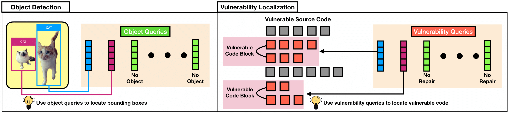

<div align="center">
  
# VIT-Inspired Automated Vulnerability Repair <br> (Reproduction of Experiments)
  
</div>



<p align="center">
  </a>
  <h3 align="center">VQM</h3>
  <p align="center">
    Vision Transformer-Inspired Automated Vulnerability Repair
  </p>
</p>
     
## Table of contents

<!-- Table of contents -->
<details open="open">
  <summary></summary>
  <ol>
    <li>
      <a href="#how-to-reproduce">How to reproduce</a>
        <ul>
          <li><a href="#environment-setup">Environment Setup</a></li>
          <li><a href="#reproduction-of-experiments">Reproduction of Experiments</a></li>
        </ul>
    </li>
    <li>
      <a href="#license">License</a>
    </li>
    <li>
      <a href="#citation">Citation</a>
    </li>
  </ol>
</details>

## How to reproduce 

### Environment Setup
<details open="open">
  <summary></summary>
  
First of all, clone this repository to your local machine and access the main dir via the following command:
```
git clone https://github.com/awsm-research/VQM.git
cd VQM
```

Then, install the python dependencies via the following command:
```
pip install -r requirements.txt
cd VQM/transformers
pip install .
cd ../..
```

* We highly recommend you check out this <a href="https://pytorch.org/">installation guide</a> for the "torch" library so you can install the appropriate version on your device.
  
* To utilize GPU (optional), you also need to install the CUDA library, you may want to check out this <a href="https://docs.nvidia.com/cuda/cuda-quick-start-guide/index.html">installation guide</a>.
  
* <a href="https://www.python.org/downloads/release/python-397/">Python 3.9.7</a> is recommended, which has been fully tested without issues.
 
</details>
 
### Reproduction of Experiments
  
  <details open="open">
    <summary></summary>
    
  Download necessary data and unzip via the following command: 
  ```
  cd data
  sh download_data.sh 
  cd ..
  ```
  
  </details>  
  
  <details open="open">
    <summary></summary>
  
  #### Reproduce Section 4 - RQ1
  - VQM (proposed approach)
    * Inference
    ```
    cd VQM/saved_models/checkpoint-best-loss
    sh download_models.sh
    cd ../..
    sh run_test.sh
    cd ..
    ```
    * Retrain Localization Model
    ```
    cd VQM
    sh run_pretrain_loc.sh
    sh run_train_loc.sh
    cd ..
    ```
    * Retrain Repair Model
    ```
    cd VQM
    sh run_pretrain.sh
    sh run_train.sh
    sh run_test.sh
    cd ..
    ```
 
 - VulRepair
    * Inference
    ```
    cd baselines/VulRepair/saved_models/checkpoint-best-loss
    sh download_models.sh
    cd ../..
    sh run_test.sh
    cd ../..
    ```
    * Retrain
    ```
    cd baselines/VulRepair
    sh run_pretrain.sh
    sh run_train.sh
    sh run_test.sh
    cd ../..
    ```
 
  - TFix
    * Inference
    ```
    cd baselines/TFix/saved_models/checkpoint-best-loss
    sh download_models.sh
    cd ../..
    sh run_test.sh
    cd ../..
    ```
    * Retrain
    ```
    cd baselines/TFix
    sh run_pretrain.sh
    sh run_train.sh
    sh run_test.sh
    cd ../..
    ```
    
  - GraphCodeBERT
    * Inference
    ```
    cd baselines/GraphCodeBERT/saved_models/checkpoint-best-loss
    sh download_models.sh
    cd ../..
    sh run_test.sh
    cd ../..
    ```
    * Retrain
    ```
    cd baselines/GraphCodeBERT
    sh run_pretrain.sh
    sh run_train.sh
    sh run_test.sh
    cd ../..
    ```
    
  - CodeBERT
    * Inference
    ```
    cd baselines/CodeBERT/saved_models/checkpoint-best-loss
    sh download_models.sh
    cd ../..
    sh run_test.sh
    cd ../..
    ```
    * Retrain
    ```
    cd baselines/CodeBERT
    sh run_pretrain.sh
    sh run_train.sh
    sh run_test.sh
    cd ../..
    ```
  
  - VRepair
    * Inference
    ```
    cd baselines/VRepair/saved_models/checkpoint-best-loss
    sh download_models.sh
    cd ../..
    sh run_test.sh
    cd ../..
    ```
    * Retrain
    ```
    cd baselines/VRepair
    sh run_pretrain.sh
    sh run_train.sh
    sh run_test.sh
    cd ../..
    ```
    
  - SequenceR
    * Inference
    ```
    cd baselines/SequenceR/saved_models/checkpoint-best-loss
    sh download_models.sh
    cd ../..
    sh run_test.sh
    cd ../..
    ```
    * Retrain
    ```
    cd baselines/SequenceR
    sh run_pretrain.sh
    sh run_train.sh
    sh run_test.sh
    cd ../..
    ```
   
  </details>
 
  <details open="open">
    <summary></summary>
    
  #### Reproduce Section 4 - RQ2 (Ablation - VQ and VM)
  - Vul Mask Encoder + Vul Mask Decoder (proposed approach - VQM)
    * Inference
    ```
    cd VQM/saved_models/checkpoint-best-loss
    sh download_models.sh
    cd ../..
    sh run_test_no_bug.sh
    cd ..
    ```
    * Retrain
    ```
    cd VQM
    sh run_pretrain.sh
    sh run_train.sh
    sh run_test.sh
    cd ..
    ```
  
  - Vul Mask Encoder
    * Inference
    ```
    cd ablation_mask/Vul_mask_enc_only/saved_models/checkpoint-best-loss
    sh download_models.sh
    cd ../..
    sh run_test.sh
    cd ../..
    ```
    * Retrain
    ```
    cd ablation_mask/Vul_mask_enc_only/saved_models/checkpoint-best-loss
    sh download_models.sh
    cd ../..
    sh run_pretrain.sh
    sh run_train.sh
    sh run_test.sh
    cd ../..
    ```
  
  - Vul Mask Decoder
    * Inference
    ```
    cd ablation_mask/Vul_mask_cross_only/saved_models/checkpoint-best-loss
    sh download_models.sh
    cd ../..
    sh run_test.sh
    cd ../..
    ```
    * Retrain
    ```
    cd ablation_mask/Vul_mask_enc_only/saved_models/checkpoint-best-loss
    sh download_models.sh
    cd ../..
    sh run_pretrain.sh
    sh run_train.sh
    sh run_test.sh
    cd ../..
    ```
  
  - Perfect Mask Encoder + Perfect Mask Decoder
    * Inference
    ```
    cd ablation_mask/Vul_perfect_mask/saved_models/checkpoint-best-loss
    sh download_models.sh
    cd ../..
    sh run_test.sh
    cd ../..
    ```
    * Retrain
    ```
    cd ablation_mask/Vul_mask_enc_only/saved_models/checkpoint-best-loss
    sh download_models.sh
    cd ../..
    sh run_pretrain.sh
    sh run_train.sh
    sh run_test.sh
    cd ../..
    ```
  
  </details>
 
  <details open="open">
    <summary></summary>
    
  #### Reproduce Section 4 - RQ2 (Ablation - Pre-training on Bug-fix Data)
  - VQM (proposed approach)
    * Inference
    ```
    cd VQM/saved_models/checkpoint-best-loss
    sh download_models.sh
    cd ../..
    sh run_test_no_bug.sh
    cd ..
    ```
    * Retrain
    ```
    sh run_train_no_bug.sh
    sh run_test_no_bug.sh
    cd ..
    ```
 
 - VulRepair
    * Inference
    ```
    cd baselines/VulRepair/saved_models/checkpoint-best-loss
    sh download_models.sh
    cd ../..
    sh run_test_no_bug.sh
    cd ../..
    ```
    * Retrain
    ```
    sh run_train_no_bug.sh
    sh run_test_no_bug.sh
    cd ../..
    ```
 
  - TFix
    * Inference
    ```
    cd baselines/TFix/saved_models/checkpoint-best-loss
    sh download_models.sh
    cd ../..
    sh run_test_no_bug.sh
    cd ../..
    ```
    * Retrain
    ```
    sh run_train_no_bug.sh
    sh run_test_no_bug.sh
    cd ../..
    ```
    
  - GraphCodeBERT
    * Inference
    ```
    cd baselines/GraphCodeBERT/saved_models/checkpoint-best-loss
    sh download_models.sh
    cd ../..
    sh run_test_no_bug.sh
    cd ../..
    ```
    * Retrain
    ```
    sh run_train_no_bug.sh
    sh run_test_no_bug.sh
    cd ../..
    ```
    
  - CodeBERT
    * Inference
    ```
    cd baselines/CodeBERT/saved_models/checkpoint-best-loss
    sh download_models.sh
    cd ../..
    sh run_test_no_bug.sh
    cd ../..
    ```
    * Retrain
    ```
    sh run_train_no_bug.sh
    sh run_test_no_bug.sh
    cd ../..
    ```
  
  - VRepair
    * Inference
    ```
    cd baselines/VRepair/saved_models/checkpoint-best-loss
    sh download_models.sh
    cd ../..
    sh run_test_no_bug.sh
    cd ../..
    ```
    * Retrain
    ```
    sh run_train_no_bug.sh
    sh run_test_no_bug.sh
    cd ../..
    ```
    
  - SequenceR
    * Inference
    ```
    cd baselines/SequenceR/saved_models/checkpoint-best-loss
    sh download_models.sh
    cd ../..
    sh run_test_no_bug.sh
    cd ../..
    ```
    * Retrain
    ```
    sh run_train_no_bug.sh
    sh run_test_no_bug.sh
    cd ../..
    ```
  </details>
    
## License 
<a href="https://github.com/awsm-research/VQM/blob/main/LICENSE">MIT License</a>

## Citation
```bash
under review
```
